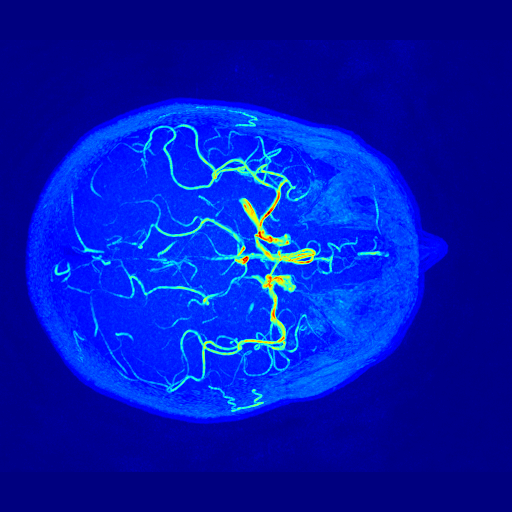
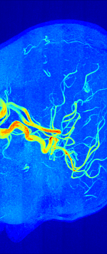
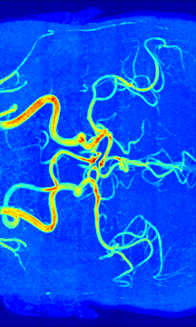

# 3 Dimensional VGG in Tensorflow

Tensorflow implementation of [Very Deep Convolutional Networks for Large-Scale Image Recognition](https://arxiv.org/abs/1409.1556) by [Visual Geometry Group](http://www.robots.ox.ac.uk/~vgg/) 

In order to predict ages based on 3D MRI Images, VGG network architecture is expanded to three dimensions.

## Prerequisites

- Python 3.3+
- [Tensorflow](https://www.tensorflow.org/)
- [SciPy](http://www.scipy.org/install.html)
- [Nibabel](http://nipy.org/nibabel/)
- (Optional) [IXI-MRA.zip](http://brain-development.org/ixi-dataset/) : Large-scale MRA Dataset

## Usage

To train a model with downloaded dataset:

    $ python mri_convolutional_neuralnet.py 

## Author

Joey
